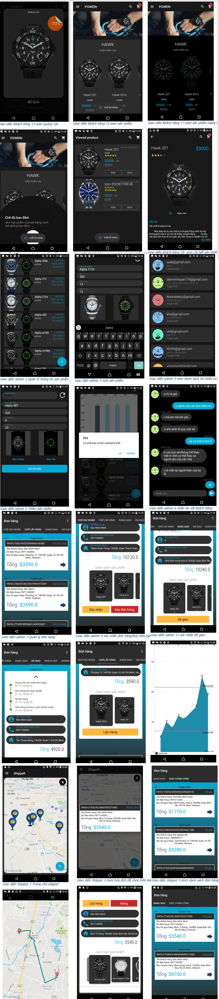

# eCommercial application

Thương mại diện tử 
II.	GIỚI THIỆU
-	đồ án cuối kỳ cho môn học Thương Mại Điện Tử do cô Thảo phụ trách giảng dạy, đề tài nhóm chọn là Mobile App thương mại điện tử đồng hồ đeo tay. Phân tích thiết kế hệ thống, và quá trình tạo nên sản phẩm cuối cùng.
1.	CHỨC NĂNG
-	Phần mềm phục vụ cho việc mua và bán đồng hồ đeo tay. Quản trị viên có thể quan lý hàng hoá, xem thống kê, tư vấn khách hàng. Người mua có thể mua hàng, thanh toán trực tuyến, quản lý đơn hàng của họ…
2.	NGƯỜI SỬ DỤNG
-	Quản trị viên (ADMIN)
-	Khách hàng (USER)
-	Người giao hàng (SHIPPER)
 
DOCUMENT : https://sthuflitedu-my.sharepoint.com/:w:/g/personal/15dh110176_st_huflit_edu_vn/EUZir3NIhLROntaEvJ9t5swBQhSL_UTrSNCdq6WF6rWCQA?e=MEJRfx
